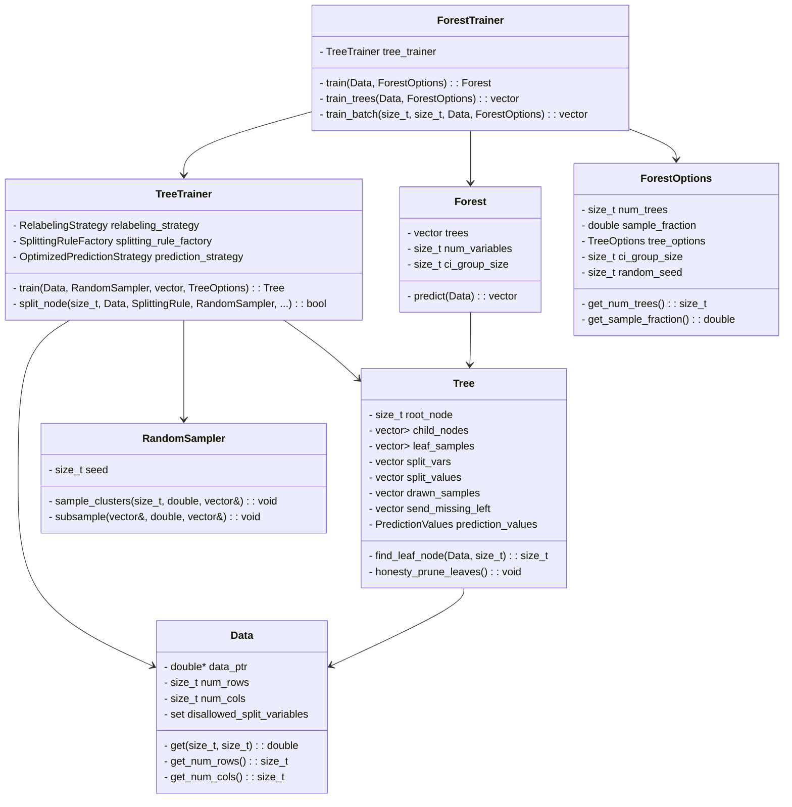

```mermaid
classDiagram
    class ForestTrainer {
        - TreeTrainer tree_trainer
        - train(Data, ForestOptions): Forest
        - train_trees(Data, ForestOptions): vector<Tree>
        - train_batch(size_t, size_t, Data, ForestOptions): vector<Tree>
    }

    class TreeTrainer {
        - RelabelingStrategy relabeling_strategy
        - SplittingRuleFactory splitting_rule_factory
        - OptimizedPredictionStrategy prediction_strategy
        - train(Data, RandomSampler, vector<size_t>, TreeOptions): Tree
        - split_node(size_t, Data, SplittingRule, RandomSampler, ...): bool
    }

    class Tree {
        - size_t root_node
        - vector<vector<size_t>> child_nodes
        - vector<vector<size_t>> leaf_samples
        - vector<size_t> split_vars
        - vector<double> split_values
        - vector<size_t> drawn_samples
        - vector<bool> send_missing_left
        - PredictionValues prediction_values
        - find_leaf_node(Data, size_t): size_t
        - honesty_prune_leaves(): void
    }

    class Data {
        - double* data_ptr
        - size_t num_rows
        - size_t num_cols
        - set<size_t> disallowed_split_variables
        - get(size_t, size_t): double
        - get_num_rows(): size_t
        - get_num_cols(): size_t
    }

    class Forest {
        - vector<Tree> trees
        - size_t num_variables
        - size_t ci_group_size
        - predict(Data): vector<double>
    }

    class ForestOptions {
        - size_t num_trees
        - double sample_fraction
        - TreeOptions tree_options
        - size_t ci_group_size
        - size_t random_seed
        - get_num_trees(): size_t
        - get_sample_fraction(): double
    }

    class RandomSampler {
        - size_t seed
        - sample_clusters(size_t, double, vector<size_t>&): void
        - subsample(vector<size_t>&, double, vector<size_t>&): void
    }

    ForestTrainer --> TreeTrainer
    TreeTrainer --> Tree
    TreeTrainer --> Data
    Tree --> Data
    ForestTrainer --> Forest
    Forest --> Tree
    ForestTrainer --> ForestOptions
    TreeTrainer --> RandomSampler
```
